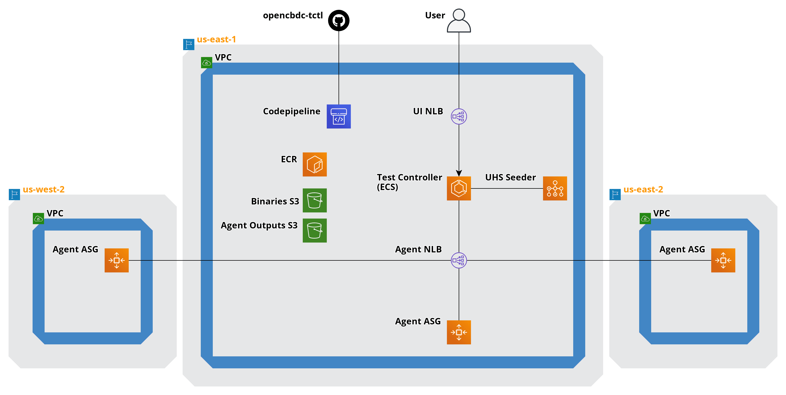
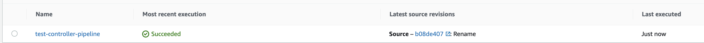
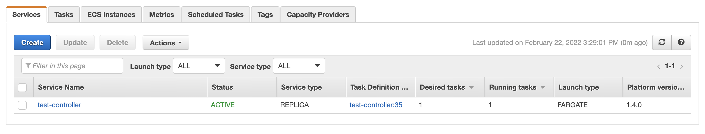

# Introduction

This repository provides IaC (Infrastructure as Code) to replicate the environment used to produce the results of the [research paper](https://dci.mit.edu/opencbdc) and can serve as a starting point if you're looking to do so.
All the necessary resources are created in [Amazon Web Services (AWS)](https://aws.amazon.com) cloud infrastructure via [Terraform](https://www.terraform.io/).
The Terraform configuration is wrapped into a single [module](https://www.terraform.io/language/modules) that leverages a number of sub-modules.
The root module primarily deploys the [OpenCBDC test controller](https://github.com/mit-dci/opencbdc-tctl) along with numerous supporting resources.
You can follow along with the steps of this README in order to deploy the test controller.
If you are new to Terraform, when you reach [Provision](#Provision), it is reccomended that you use the pre-created configuration linked there as the entrypoint for your deployment.

# Architecture

This module will deploy the test controller via an [AWS ECS](https://docs.aws.amazon.com/AmazonECS/latest/developerguide/Welcome.html) task.
The ECS service can be configured to use either EC2 instances or Fargate.
The main function of the test controller is to schedule agent processes across one to three regions for testing Project Hamilton's architectures.
Agents processes are scheduled on [AWS EC2](https://docs.aws.amazon.com/AWSEC2/latest/UserGuide/concepts.html) instances and provisioned via EC2 launch templates.
The test controller is configured to provision in the `us-east-1` region.
A subset of resources are replicated in the `us-east-2` and `us-west-2` regions in order to schedule multi regional test runs.
A VPC is provisioned in each of these three regions along with VPC peering connections and VPC endpoints for internal communication between resources.
A pipeline is setup via [AWS Codepipeline](https://docs.aws.amazon.com/codepipeline/latest/userguide/welcome.html) which will clone the test controller's source code, then build/push several services.
These services are a container image for the test controller, a container image used to seed the environment with data for test runs, and the binary used to schedule agents during test runs.
Both of the container images are pushed to [AWS ECR](https://docs.aws.amazon.com/AmazonECR/latest/userguide/what-is-ecr.html) registries, and the agent binary is pushed to an S3 bucket.
Seeding initial outputs is handled via an [AWS Batch job](https://docs.aws.amazon.com/batch/latest/userguide/what-is-batch.html) that when necessary is scheduled by the test controller before a test run.
An AWS Batch compute environment, job definition, and job queue are all provisioned by default to support this.
Upon being schdeuled, agents instances pull the agent binary from S3, then execute it to communicate with the test controller and recieve instructions.
This process for the agents is defined in thier EC2 launch template.
Two [AWS Network Load balancers](https://docs.aws.amazon.com/elasticloadbalancing/latest/network/introduction.html) are deployed by the module.
One forwards traffic to the test controller's UI, the other supports communication between agents and the test controller.
A bastion host is provided for troubleshooting the environment as well as pulling down raw test data if you wish to gather your own insights.
To access to the bastion host you can either use ssh, which is configured by this module, or you can use [AWS Session Manager](https://docs.aws.amazon.com/systems-manager/latest/userguide/session-manager.html).



# Required Software

The module requires that you have [Terraform installed](https://learn.hashicorp.com/tutorials/terraform/install-cli).
Specifics about versioning are listed [here](#Requirements).
Also useful, but not completely necessary is the [AWS CLI](https://docs.aws.amazon.com/cli/latest/userguide/getting-started-install.html).
If you have other Terraform projects with different version requirements, you can manage them with [tfenv](https://github.com/tfutils/tfenv).
This project is pre-configured to pull the proper terraform version via tfenv.
Simply run `tfenv install`.
Docker must be [installed and running](https://docs.docker.com/engine/install/) on your local machine.
You won't need to run any Docker commands, just be sure that it's running.
If you're unfamiliar with Docker and curious, you can take a look at their [getting started page](https://docs.docker.com/get-started/).

# Pre-Provision

## Generate and Add an SSH Key

This module requires you provide an ssh public key which will be used to generate an [Amazon EC2 key pair](https://docs.aws.amazon.com/AWSEC2/latest/UserGuide/ec2-key-pairs.html).
AWS can use either ED25519 or 2048-bit SSH-2 RSA keys.
There are a number of third party tools that can be used to generate an approrpiate keypair.
One way is via the `ssh-keygen` command provided by [OpenSSH](https://www.openssh.com/).
```console
$ ssh-keygen -t RSA -f /path/to/key/file/id_rsa
``` 
Installation for OpenSSH will depend on the OS of your machine.
* On MacOS OpenSSH should be installed by default.
* On [Windows](https://ubuntu.com/tutorials/ssh-keygen-on-windows#1-overview) you may need to follow addional steps.
* On Ubuntu/Debian/Linux Mint:
```console
$ sudo apt-get install openssh-client
``` 
* On RHEL/Centos/Fedora:
```console
$ sudo yum -y install openssh-clients

```
After doing so, provide the contents of the public key (`id_rsa.pub`) file to the module's `public_key` var.
The ssh private key should remain private.

## Register a Domain

***New Domain -*** Currently, the test controller requires that you own a domain with a registrar and a hosted zone configured in Route53.
The name of the hosted zone should be set as the `base_domain` var and the necessary DNS records will be created by this Terraform module.
If you don't currently own a domain, you can purchase one via the Route53 registrar, doing so creates a hosted zone in Route53 automatically.
This is our recommended approach.

***BYO Domain -*** If you already own a domain that you wish to use you can do so, however you'll still need to [create a hosted zone in Route53](https://docs.aws.amazon.com/Route53/latest/DeveloperGuide/CreatingHostedZone.html).
To do this, set the flag create_hosted_zone to true.
The module output route53_name_servers will provide a list of name servers associated with the hosted zone.
Use these to delegate DNS resolution for the domain to route53.
For BYO domains, we recommend using a sub-domain (test.foo.com) as base_domain rather than using a top level domain (foo.com) and delegating name server resolution to route53 for that subdomain.

## Generate and Add a Github Access Token

Once deployed, this module will create a pipeline in AWS Codepipeline, which builds and pushes several container images related to the test controller.
In order to perform this Codepipeline will clone the test controller codebase.
Codepipeline must be connected to a Github account to clone from a Github repo.
A [personal access token](https://docs.github.com/en/enterprise/2.17/user/github/authenticating-to-github/creating-a-personal-access-token-for-the-command-line) should be passed to codepipeline for authentication.
The token should only need the `public_repo` permission.
After creating this, you can provide it to the module via the `test_controller_github_access_token` var.

## Configure IAM Permissions

Terraform will require permission to access multiple services in AWS.
Permissions in AWS are managed via the [IAM service](https://docs.aws.amazon.com/IAM/latest/UserGuide/introduction.html).
Generally speaking you want to provide the smallest set of permissions possible to a role.
This is known as the Principle of Least Privilege.
Since Terraform here will be interacting with such a wide array of services to deploy the test controller, for simplicity you can grant [Administrator Access](https://docs.aws.amazon.com/IAM/latest/UserGuide/access_policies_job-functions.html#jf_administrator).
This can be attached to an [IAM user](https://docs.aws.amazon.com/IAM/latest/UserGuide/id_users.html) that Terraform can [authenticate against](https://registry.terraform.io/providers/hashicorp/aws/latest/docs#authentication).
If you'd like to restrict Terraform's access with a fine toothed comb however you certainly can.

# Provision

This repo contains Terraform configuration mirroring that of the research paper [here](./examples/opencbdc-tctl).
This is intended to serve as your main entrypoint for your deployment.
Deployment instructions are located [here](./examples/opencbdc-tctl/README.md#Usage).
If you want to configure the environment for your own tests this module provides a [number of inputs](#Inputs) for doing so.

# Post-Provision

## Invoke the Certbot Lambda

The test controller requires an SSL certificate to allow for client connections via HTTPS.
This module will provision a Lambda capable of generating an appropriate cert issued via [Let's Encrypt](https://letsencrypt.org/).
The lambda is configured to fire off every twelve hours to check that the cert has yet to expire.
If you wish to run tests in your environment immediately provisioning, you will need to invoke the lambda yourself.
You do this via the AWS CLI.
Using the credentials you configured for your environment, run:
```console
$ aws lambda invoke --region us-east-1 --function-name test-controller-certbot-lambda /dev/stdout
```
<br />**Note -** The lambda usually takes a few minutes to complete it's execution.
<br />**Note -** The lambda will create a certificate in [AWS Certificate Manager](https://docs.aws.amazon.com/acm/latest/userguide/acm-overview.html).
This is not tied to the terraform automation, so you will need to delete it manually after running a `terraform destroy`.
You should delete it only after you've destroyed everything else.
To do so, simply select the certificate with the test controller domain name `test-controller.<base_domain>` and hit "delete".

## Monitor Codepipeline
The test controller pipeline should run automatically.
All pipeline phases must succeed before you can run any tests.
You can verify this by checking the most recent execution status of `test-controller-pipeline` in the AWS Codepipeline service.



Codepipeline will poll for the latest changes to the test controller repo.
This way you will recieve updates automatically without any manual intervention.
Occasionally, Codepipeline may fail during the deployment process.
These are usually transient errors which will resolve by simply running the pipeline again.
Using the credentials you configured for your environment, run:
```console
$ aws lambda invoke --region us-east-1 --function-name test-controller-certbot-lambda /dev/stdout
```

## Monitor Health Checks

Both the test controller's UI and API exist inside of a single ECS task.
The task must be running and healthy before you can schedule test runs in your environment.
Three sets of target groups are configured against the task, one as an entrypoint for agents, one for authentication, and one for the test controller's UI.
The task will be scheduled under the `test-controller` service, which belongs to a cluster with the same name as whatever the Terraform var `environment` is set to.
It's easiest to verify these in the AWS console.
When the environment is healthy, these services should look like the following:




## Access the Test Controller

The module will generate some DNS records in [AWS Route53](https://docs.aws.amazon.com/Route53/latest/DeveloperGuide/Welcome.html) for you.
A CNAME record is created in Route53 which will point to the UI load balancer.
The format of this will be `test-controller.<base_domain>`.
The `environment` and `base_domain` values will be set to whatever you configured to the corresponding Terraform vars.
Assuming your environment is up and configured properly, you should be able to access by typing the url into any browser.
In a fresh environment, you will need to add a client certificate into the environment in order to authenticate with the test controller.
The process for this is documented in the test controller's [README](https://github.com/mit-dci/opencbdc-tctl#authentication).
<br />**Note -** This module configures the port 8443 to route to the auth endpoint via the network load balancer.
This means the port must be specified in the url you enter into the browser `https://test-controller.<base_domain>:8443/auth`.
The appropriate record is also provided as an output `route53_endpoints.ui_endpoint`.

## Request Limit Increases (Optional)
Some plots shown in the paper require a great deal of compute power to reproduce.
The default quotas for EC2 instances set on AWS accounts will likely be insufficient in some cases.
The test controller will schedule instances using available vCPUs based on the service quota API, meaning it will run what it can instead of reporting errors.
To reproduce entire plots, you will need to [submit requests](https://docs.aws.amazon.com/AWSEC2/latest/UserGuide/ec2-resource-limits.html#request-increase) limit increases on several EC2 service quotas.
Specifically:
| Quota Name | us-east-1 | us-east-2 | us-west-2 |
|-------|-----------|-----------|-----------|
| All Standard (A, C, D, H, I, M, R, T, Z) Spot Instance Requests | 32,000 | 32,000 | 32,000 |
| Running On-Demand Standard (A, C, D, H, I, M, R, T, Z) instances | 32,000 | 32,000 | 32,000 |


<!-- BEGIN_TF_DOCS -->
## Requirements

| Name | Version |
|------|---------|
| <a name="requirement_terraform"></a> [terraform](#requirement\_terraform) | = 0.13.4 |
| <a name="requirement_aws"></a> [aws](#requirement\_aws) | ~> 3.0 |

## Providers

| Name | Version |
|------|---------|
| <a name="provider_aws"></a> [aws](#provider\_aws) | ~> 3.0 |
| <a name="provider_aws.use2"></a> [aws.use2](#provider\_aws.use2) | ~> 3.0 |
| <a name="provider_aws.usw2"></a> [aws.usw2](#provider\_aws.usw2) | ~> 3.0 |
| <a name="provider_template"></a> [template](#provider\_template) | n/a |

## Modules

| Name | Source | Version |
|------|--------|---------|
| <a name="module_bastion"></a> [bastion](#module\_bastion) | ./modules/bastion | n/a |
| <a name="module_ec2_profile"></a> [ec2\_profile](#module\_ec2\_profile) | terraform-aws-modules/ecs/aws//modules/ecs-instance-profile | 3.0.0 |
| <a name="module_ecs"></a> [ecs](#module\_ecs) | terraform-aws-modules/ecs/aws | 3.0.0 |
| <a name="module_ecs_cluster_asg"></a> [ecs\_cluster\_asg](#module\_ecs\_cluster\_asg) | terraform-aws-modules/autoscaling/aws | 3.9.0 |
| <a name="module_ecs_cluster_security_group"></a> [ecs\_cluster\_security\_group](#module\_ecs\_cluster\_security\_group) | terraform-aws-modules/security-group/aws | 3.1.0 |
| <a name="module_route53_dns"></a> [route53\_dns](#module\_route53\_dns) | ./modules/route53_dns | n/a |
| <a name="module_test_controller_agent_use1"></a> [test\_controller\_agent\_use1](#module\_test\_controller\_agent\_use1) | ./modules/test-controller-agent | n/a |
| <a name="module_test_controller_agent_use2"></a> [test\_controller\_agent\_use2](#module\_test\_controller\_agent\_use2) | ./modules/test-controller-agent | n/a |
| <a name="module_test_controller_agent_usw2"></a> [test\_controller\_agent\_usw2](#module\_test\_controller\_agent\_usw2) | ./modules/test-controller-agent | n/a |
| <a name="module_test_controller_deploy"></a> [test\_controller\_deploy](#module\_test\_controller\_deploy) | ./modules/test-controller-deploy | n/a |
| <a name="module_test_controller_service"></a> [test\_controller\_service](#module\_test\_controller\_service) | ./modules/test-controller | n/a |
| <a name="module_uhs_seed_generator"></a> [uhs\_seed\_generator](#module\_uhs\_seed\_generator) | ./modules/uhs-seed-generator | n/a |
| <a name="module_vpc"></a> [vpc](#module\_vpc) | terraform-aws-modules/vpc/aws | 2.70.0 |
| <a name="module_vpc_endpoints_use1"></a> [vpc\_endpoints\_use1](#module\_vpc\_endpoints\_use1) | ./modules/vpc-endpoints | n/a |
| <a name="module_vpc_endpoints_use2"></a> [vpc\_endpoints\_use2](#module\_vpc\_endpoints\_use2) | ./modules/vpc-endpoints | n/a |
| <a name="module_vpc_endpoints_usw2"></a> [vpc\_endpoints\_usw2](#module\_vpc\_endpoints\_usw2) | ./modules/vpc-endpoints | n/a |
| <a name="module_vpc_peering_connection_use1_use2"></a> [vpc\_peering\_connection\_use1\_use2](#module\_vpc\_peering\_connection\_use1\_use2) | ./modules/vpc-peering-connection | n/a |
| <a name="module_vpc_peering_connection_use1_usw2"></a> [vpc\_peering\_connection\_use1\_usw2](#module\_vpc\_peering\_connection\_use1\_usw2) | ./modules/vpc-peering-connection | n/a |
| <a name="module_vpc_peering_connection_use2_usw2"></a> [vpc\_peering\_connection\_use2\_usw2](#module\_vpc\_peering\_connection\_use2\_usw2) | ./modules/vpc-peering-connection | n/a |
| <a name="module_vpc_use2"></a> [vpc\_use2](#module\_vpc\_use2) | terraform-aws-modules/vpc/aws | 2.70.0 |
| <a name="module_vpc_usw2"></a> [vpc\_usw2](#module\_vpc\_usw2) | terraform-aws-modules/vpc/aws | 2.70.0 |

## Resources

| Name | Type |
|------|------|
| [aws_cloudwatch_log_group.agents_use1](https://registry.terraform.io/providers/hashicorp/aws/latest/docs/resources/cloudwatch_log_group) | resource |
| [aws_cloudwatch_log_group.agents_use2](https://registry.terraform.io/providers/hashicorp/aws/latest/docs/resources/cloudwatch_log_group) | resource |
| [aws_cloudwatch_log_group.agents_usw2](https://registry.terraform.io/providers/hashicorp/aws/latest/docs/resources/cloudwatch_log_group) | resource |
| [aws_iam_service_linked_role.ecs](https://registry.terraform.io/providers/hashicorp/aws/latest/docs/resources/iam_service_linked_role) | resource |
| [aws_s3_bucket.agent_outputs](https://registry.terraform.io/providers/hashicorp/aws/latest/docs/resources/s3_bucket) | resource |
| [aws_s3_bucket.binaries](https://registry.terraform.io/providers/hashicorp/aws/latest/docs/resources/s3_bucket) | resource |
| [aws_availability_zones.use1](https://registry.terraform.io/providers/hashicorp/aws/latest/docs/data-sources/availability_zones) | data source |
| [aws_availability_zones.use2](https://registry.terraform.io/providers/hashicorp/aws/latest/docs/data-sources/availability_zones) | data source |
| [aws_availability_zones.usw2](https://registry.terraform.io/providers/hashicorp/aws/latest/docs/data-sources/availability_zones) | data source |
| [aws_caller_identity.current](https://registry.terraform.io/providers/hashicorp/aws/latest/docs/data-sources/caller_identity) | data source |
| [aws_region.current](https://registry.terraform.io/providers/hashicorp/aws/latest/docs/data-sources/region) | data source |
| [aws_ssm_parameter.ecs_optimized_ami](https://registry.terraform.io/providers/hashicorp/aws/latest/docs/data-sources/ssm_parameter) | data source |
| [template_file.user_data](https://registry.terraform.io/providers/hashicorp/template/latest/docs/data-sources/file) | data source |

## Inputs

| Name | Description | Type | Default | Required |
|------|-------------|------|---------|:--------:|
| <a name="input_agent_instance_types"></a> [agent\_instance\_types](#input\_agent\_instance\_types) | The instance types used in agent launch templates. | `list(string)` | <pre>[<br>  "c5n.large",<br>  "c5n.2xlarge",<br>  "c5n.9xlarge",<br>  "c5n.metal"<br>]</pre> | no |
| <a name="input_base_domain"></a> [base\_domain](#input\_base\_domain) | Base domain to use for ACM Cert and Route53 record management. | `string` | `""` | no |
| <a name="input_cluster_instance_type"></a> [cluster\_instance\_type](#input\_cluster\_instance\_type) | If test controller launch type is EC2, the instance size to use. | `string` | `"c5ad.12xlarge"` | no |
| <a name="input_create_certbot_lambda"></a> [create\_certbot\_lambda](#input\_create\_certbot\_lambda) | Boolean to create the certbot lambda to update the letsencrypt cert for the test controller. | `bool` | `true` | no |
| <a name="input_create_hosted_zone"></a> [create\_hosted\_zone](#input\_create\_hosted\_zone) | Flag to create hosted zone in Route53, set to true if domain is registerd outside of Route53 | `bool` | `false` | no |
| <a name="input_create_uhs_seed_generator"></a> [create\_uhs\_seed\_generator](#input\_create\_uhs\_seed\_generator) | Determines whether or not to create uhs seed generator resources | `bool` | `true` | no |
| <a name="input_environment"></a> [environment](#input\_environment) | AWS tag to indicate environment name of each infrastructure object. | `string` | n/a | yes |
| <a name="input_lets_encrypt_email"></a> [lets\_encrypt\_email](#input\_lets\_encrypt\_email) | Email to associate with let's encrypt certificate | `string` | n/a | yes |
| <a name="input_private_subnet_tags"></a> [private\_subnet\_tags](#input\_private\_subnet\_tags) | Tags associated with private subnets | `map(string)` | `{}` | no |
| <a name="input_public_key"></a> [public\_key](#input\_public\_key) | SSH public key to use in EC2 instances. | `string` | `""` | no |
| <a name="input_public_subnet_tags"></a> [public\_subnet\_tags](#input\_public\_subnet\_tags) | Tags associated with public subnets | `map(string)` | `{}` | no |
| <a name="input_resource_tags"></a> [resource\_tags](#input\_resource\_tags) | Tags to set for all resources | `map(string)` | `{}` | no |
| <a name="input_subnet_prefix_extension"></a> [subnet\_prefix\_extension](#input\_subnet\_prefix\_extension) | CIDR block bits extension to calculate CIDR blocks of each subnetwork. | `number` | `4` | no |
| <a name="input_test_controller_app_container_base_image"></a> [test\_controller\_app\_container\_base\_image](#input\_test\_controller\_app\_container\_base\_image) | An optional custom container base image for the test controller and releated services | `string` | `"ubuntu:20.04"` | no |
| <a name="input_test_controller_cpu"></a> [test\_controller\_cpu](#input\_test\_controller\_cpu) | The ECS task CPU | `string` | `"4096"` | no |
| <a name="input_test_controller_github_access_token"></a> [test\_controller\_github\_access\_token](#input\_test\_controller\_github\_access\_token) | Access token for cloning test controller repo | `string` | n/a | yes |
| <a name="input_test_controller_github_repo"></a> [test\_controller\_github\_repo](#input\_test\_controller\_github\_repo) | The Github repo base name | `string` | `"opencbdc-tctl"` | no |
| <a name="input_test_controller_github_repo_branch"></a> [test\_controller\_github\_repo\_branch](#input\_test\_controller\_github\_repo\_branch) | The repo branch to use for the Test Controller deployment pipeline. | `string` | `"trunk"` | no |
| <a name="input_test_controller_github_repo_owner"></a> [test\_controller\_github\_repo\_owner](#input\_test\_controller\_github\_repo\_owner) | The Github repo owner | `string` | `"mit-dci"` | no |
| <a name="input_test_controller_golang_container_build_image"></a> [test\_controller\_golang\_container\_build\_image](#input\_test\_controller\_golang\_container\_build\_image) | An optional custom container build image for test controller Golang depencies | `string` | `"golang:1.16"` | no |
| <a name="input_test_controller_health_check_grace_period_seconds"></a> [test\_controller\_health\_check\_grace\_period\_seconds](#input\_test\_controller\_health\_check\_grace\_period\_seconds) | The ECS service health check grace period in seconds | `number` | `300` | no |
| <a name="input_test_controller_launch_type"></a> [test\_controller\_launch\_type](#input\_test\_controller\_launch\_type) | The ECS task launch type to run the test controller. | `string` | `"FARGATE"` | no |
| <a name="input_test_controller_memory"></a> [test\_controller\_memory](#input\_test\_controller\_memory) | The ECS task memory | `string` | `"30720"` | no |
| <a name="input_test_controller_node_container_build_image"></a> [test\_controller\_node\_container\_build\_image](#input\_test\_controller\_node\_container\_build\_image) | An optional custom container build image for test controller Nodejs depencies | `string` | `"node:14"` | no |
| <a name="input_transaction_processor_main_branch"></a> [transaction\_processor\_main\_branch](#input\_transaction\_processor\_main\_branch) | Main branch of transaction repo | `string` | `"trunk"` | no |
| <a name="input_transaction_processor_repo_url"></a> [transaction\_processor\_repo\_url](#input\_transaction\_processor\_repo\_url) | Transaction repo cloned by the test controller for load generation logic | `string` | `"https://github.com/mit-dci/opencbdc-tx.git"` | no |
| <a name="input_uhs_seed_generator_job_memory"></a> [uhs\_seed\_generator\_job\_memory](#input\_uhs\_seed\_generator\_job\_memory) | Memory required for a seed generator batch job | `string` | `"8192"` | no |
| <a name="input_uhs_seed_generator_job_vcpu"></a> [uhs\_seed\_generator\_job\_vcpu](#input\_uhs\_seed\_generator\_job\_vcpu) | Vcpus required for a seed generator batch job | `string` | `"4"` | no |
| <a name="input_uhs_seed_generator_max_vcpus"></a> [uhs\_seed\_generator\_max\_vcpus](#input\_uhs\_seed\_generator\_max\_vcpus) | Max vcpus allocatable to the seed generator environment | `string` | `"50"` | no |
| <a name="input_use1_main_network_block"></a> [use1\_main\_network\_block](#input\_use1\_main\_network\_block) | Base CIDR block to be used in us-east-1. | `string` | `"10.0.0.0/16"` | no |
| <a name="input_use2_main_network_block"></a> [use2\_main\_network\_block](#input\_use2\_main\_network\_block) | Base CIDR block to be used in us-east-2. | `string` | `"10.10.0.0/16"` | no |
| <a name="input_usw2_main_network_block"></a> [usw2\_main\_network\_block](#input\_usw2\_main\_network\_block) | Base CIDR block to be used in us-west-2. | `string` | `"10.20.0.0/16"` | no |
| <a name="input_zone_offset"></a> [zone\_offset](#input\_zone\_offset) | CIDR block bits extension offset to calculate Public subnets, avoiding collisions with Private subnets. | `number` | `8` | no |

## Outputs

| Name | Description |
|------|-------------|
| <a name="output_azs_use1"></a> [azs\_use1](#output\_azs\_use1) | Availability zones used by VPC located in us-east-1 region |
| <a name="output_azs_use2"></a> [azs\_use2](#output\_azs\_use2) | Availability zones used by VPC located in us-east-2 region |
| <a name="output_azs_usw2"></a> [azs\_usw2](#output\_azs\_usw2) | Availability zones used by VPC located in us-west-2 region |
| <a name="output_ecs_cluster_id"></a> [ecs\_cluster\_id](#output\_ecs\_cluster\_id) | ECS cluster id |
| <a name="output_ecs_cluster_name"></a> [ecs\_cluster\_name](#output\_ecs\_cluster\_name) | ECS cluster name |
| <a name="output_private_subnets_use1"></a> [private\_subnets\_use1](#output\_private\_subnets\_use1) | Private subnet Ids associated with VPC in us-east-1 region |
| <a name="output_private_subnets_use2"></a> [private\_subnets\_use2](#output\_private\_subnets\_use2) | Private subnet Ids associated with VPC in us-east-2 region |
| <a name="output_private_subnets_usw2"></a> [private\_subnets\_usw2](#output\_private\_subnets\_usw2) | Private subnet Ids associated with VPC in us-west-2 region |
| <a name="output_public_subnets_use1"></a> [public\_subnets\_use1](#output\_public\_subnets\_use1) | Public subnet Ids associated with VPC in us-east-1 region |
| <a name="output_public_subnets_use2"></a> [public\_subnets\_use2](#output\_public\_subnets\_use2) | Public subnet Ids associated with VPC in us-east-2 region |
| <a name="output_public_subnets_usw2"></a> [public\_subnets\_usw2](#output\_public\_subnets\_usw2) | Public subnet Ids associated with VPC in us-west-2 region |
| <a name="output_route53_endpoints"></a> [route53\_endpoints](#output\_route53\_endpoints) | Route53 endpoints generated by test controller services |
| <a name="output_s3_vpc_interface_endpoint_use1"></a> [s3\_vpc\_interface\_endpoint\_use1](#output\_s3\_vpc\_interface\_endpoint\_use1) | S3 service interface endpoint asscoiated with VPC in us-east-1 region |
| <a name="output_s3_vpc_interface_endpoint_use2"></a> [s3\_vpc\_interface\_endpoint\_use2](#output\_s3\_vpc\_interface\_endpoint\_use2) | S3 service interface endpoint asscoiated with VPC in us-east-2 region |
| <a name="output_s3_vpc_interface_endpoint_usw2"></a> [s3\_vpc\_interface\_endpoint\_usw2](#output\_s3\_vpc\_interface\_endpoint\_usw2) | S3 service interface endpoint asscoiated with VPC in us-west-2 region |
| <a name="output_vpc_id_use1"></a> [vpc\_id\_use1](#output\_vpc\_id\_use1) | Id of VPC in us-east-1 region |
| <a name="output_vpc_id_use2"></a> [vpc\_id\_use2](#output\_vpc\_id\_use2) | Id of VPC in us-east-2 region |
| <a name="output_vpc_id_usw2"></a> [vpc\_id\_usw2](#output\_vpc\_id\_usw2) | Id of VPC in us-west-2 region |
<!-- END_TF_DOCS -->
